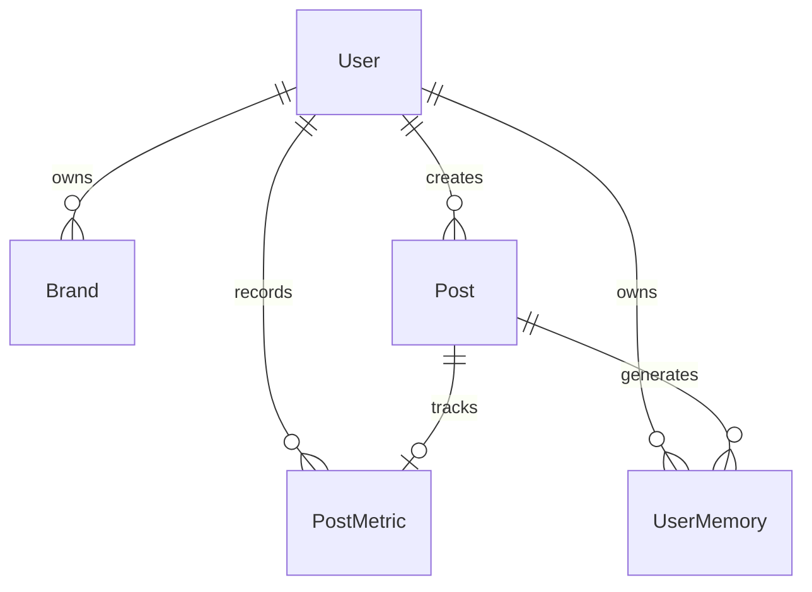

# SocialMind (SocialPulse) — AI Social Media Engagement & Intelligence Agent

> **"AI Agents That Learn Using Hindsight Memory"**  
> *Developed for HackwithHyderabad 3.0 • Problem Statement: AI Agents That Learn Using Hindsight*

[](https://nodejs.org)
[](https://expressjs.com)
[](https://react.dev)
[](https://vitejs.dev)
[](https://mongoosejs.com)
[](https://hindsight.vectorize.io)
[-f55036.svg)](https://groq.com)
[](https://tailwindcss.com)

---

## 📌 Executive Summary

Modern Large Language Models suffer from **epistemic amnesia**: every generation request begins from a tabula rasa state. In social media content strategy, this causes LLMs to produce generic, clichéd listicles that fail to capture a brand's unique voice, ignore historical failures, and disregard what actually resonates with a specific audience.

**SocialMind (SocialPulse)** is an autonomous social media intelligence agent built on top of **Vectorize Hindsight** and **Groq (openai/gpt-oss-120b)**. Instead of treating content creation as isolated, one-shot prompts, SocialMind maintains a persistent, episodic memory bank. It recalls past content outcomes before generating new posts, evaluates real-world audience metrics through deterministic benchmarks, synthesizes qualitative behavioral takeaways with sample-size awareness, and retains those experiences to continuously refine future strategies.

---

## 🧠 System Architecture & The Closed Cognitive Loop

The agent implements an iterative cognitive architecture that grounds every creative decision in past experiential telemetry.

```
                                 ┌──────────────────────────────┐
                                 │   User Idea / Trend Prompt   │
                                 └──────────────┬───────────────┘
                                                │
                                                ▼
┌─────────────────────────────────────────────────────────────────────────────────────────────┐
│ 1. MULTI-ANGLE RECALL (Vectorize Hindsight Cloud API)                                       │
│    Queries memory bank across 3 strategic vectors:                                          │
│    • Platform & Content Angle   • Engagement & Format Angle   • Audience Preference Angle    │
│    Dedupes memory items by ID and ranks by semantic relevance scores.                       │
└───────────────────────────────────────────────┬─────────────────────────────────────────────┘
                                                │
                                                ▼
┌─────────────────────────────────────────────────────────────────────────────────────────────┐
│ 2. REASON & FORMULATE (Groq openai/gpt-oss-120b)                                            │
│    • Ingests user intent + multi-angle recalled memories + brand voice constraints.         │
│    • Strict Anti-Hallucination Guardrails: Blocks fabricated credentials, stats, or quotes. │
│    • Emits structured JSON: Strategy rationale, opening hook, outline, optimal time window, │
│      and ready-to-publish copy (LinkedIn post or Instagram 5-slide carousel / reel concept).│
└───────────────────────────────────────────────┬─────────────────────────────────────────────┘
                                                │
                                                ▼
┌─────────────────────────────────────────────────────────────────────────────────────────────┐
│ 3. CONTENT DEPLOYMENT & METRIC INGESTION (Real-World Telemetry)                             │
│    Content is published to LinkedIn / Instagram. Days later, real performance telemetry is  │
│    logged: Impressions, Likes, Comments, Shares / Saves.                                    │
└───────────────────────────────────────────────┬─────────────────────────────────────────────┘
                                                │
                                                ▼
┌─────────────────────────────────────────────────────────────────────────────────────────────┐
│ 4. DETERMINISTIC ANALYTICS & SAMPLE-SIZE EVALUATION (Analytics Service)                     │
│    • Calculates Engagement Rate: ((Likes + Comments + Shares) / Impressions) * 100         │
│    • Evaluates Delta vs Account Baseline (Default: 2.50%)                                   │
│    • Statistical Sample Check: Flags impressions < 100 as "Early Signal" (low confidence)   │
│      vs 100+ impressions as "Statistically Sufficient" (high confidence).                   │
└───────────────────────────────────────────────┬─────────────────────────────────────────────┘
                                                │
                                                ▼
┌─────────────────────────────────────────────────────────────────────────────────────────────┐
│ 5. QUALITATIVE REFLECTION & RETAIN (Hindsight Service + UserMemory)                         │
│    • LLM transforms numeric deltas into a behavioral learning statement.                    │
│    • Executes Hindsight RETAIN to store the experience into the cloud memory bank.          │
│    • Persists user-scoped memory record into MongoDB for isolated multi-tenant tracking.    │
└───────────────────────────────────────────────┬─────────────────────────────────────────────┘
                                                │
                                                ▼
                                 ┌──────────────────────────────┐
                                 │ Next Strategy Cycle (Smarter)│
                                 └──────────────────────────────┘
```

---

## ⚡ Core Engineering Highlights

### 1. Multi-Angle Experiential Recall
Single-query vector searches often suffer from recall blind spots. SocialMind executes concurrent multi-angle queries across three distinct semantic axes:
- **`platform_content`**: Platform-specific norms and topic taxonomy (`${platform} content ${topic}`).
- **`engagement_format`**: Structural mechanics, hooks, and CTAs (`${topic} engagement format hook CTA`).
- **`audience_preference`**: Community reactions and sentiment (`${audience} audience response preference`).

Results are deduplicated by memory ID, sorted by semantic relevance score, and injected into the LLM context window with explicit attribution tags.

### 2. Prescriptive Hero Engine: "What Should I Post?"
Rather than waiting for user inspiration, SocialMind provides a proactive recommendation engine that cross-references:
1. **Recent Publishing History**: Last 6 posts from MongoDB to prevent topic exhaustion.
2. **Real-Time Industry Trends**: Active momentum topics and categories with growth scores.
3. **Historical Hindsight Memories**: What post formats generated above-benchmark engagement.
4. **Platform Dynamics**: Tailored for LinkedIn thought leadership or Instagram visual carousels.

It outputs a prioritized topic, recommended format, confidence score, exact hook, structural steps, and complete draft copy ready for publication.

### 3. Anti-Hallucination & Truthful Grounding Engine
Generative social media assistants frequently fabricate personal anecdotes, inflated metrics, and non-existent company exits. SocialMind enforces strict prompt contracts:
- Rejects invented author achievements, salary figures, or interview ratios unless explicitly provided in user context.
- Converts generic prompts (e.g., *"Write about 50 interview questions"*) into grounded, authoritative frameworks rather than fictitious personal retrospectives.
- Guarantees natural, engaging copy without clumsy disclaimer apologies.

### 4. Sample-Size-Aware Cognitive Reflection
Social media algorithms exhibit high variance on small sample sizes. If a post garners only 10 impressions and 1 like, calculating a 10% engagement rate must not convince the agent that this format is universally superior.
- **`< 100 Impressions`**: Evaluated as an `early_signal`. The LLM reflection explicitly states that findings are preliminary and require greater distribution before forming a definitive audience preference.
- **`≥ 100 Impressions`**: Treated as statistically robust. The LLM draws definitive conclusions about format affinity and writes high-confidence strategic directives.

### 5. Multi-Platform Content Studio
Dedicated creative modes for both B2B and visual social platforms:
- **LinkedIn Engine**: In-depth case studies, engineering frameworks, contrarian debate angles, actionable playbooks, and debate-sparking CTAs.
- **Instagram Engine**: 5-slide carousel breakdowns, 30-second Reel concepts with 3-second retention hooks, aesthetic caption spacing, visual layout prompts, and niche hashtag clusters.
- **Studio Micro-Actions**: Instant on-demand tools for hook optimization, CTA generation, tone rewriting, and carousel slide structuring.

### 6. Trend Intelligence Engine
Monitors high-momentum industry themes categorized across AI & Tech, Engineering Leadership, and Visual Storytelling. Users can filter by platform and category, view growth momentum scores (0–100), and trigger **Connect to Content** to bridge any trend directly to audience memory for immediate strategy formulation.

### 7. Persistent Memory Reflection (`REFLECT`)
In addition to retrieving individual memories, SocialMind exposes Hindsight's `reflect` primitive to synthesize high-level strategic principles across dozens of accumulated memories, surfacing account-wide dos and don'ts.

---

## 🛠️ Technology Stack

| Layer | Technology | Description |
| :--- | :--- | :--- |
| **Backend Runtime** | Node.js (v18+) | Asynchronous event-driven I/O engine |
| **API Framework** | Express.js 4.21 | Modular REST API with MVC architecture |
| **Database** | MongoDB & Mongoose 8.9 | Schematized data persistence for users, posts, metrics, and trends |
| **Long-Term Memory** | Vectorize Hindsight Client 0.10 | Cloud episodic memory bank (`Social-Media-Agent`) |
| **LLM Inference** | Groq (`openai/gpt-oss-120b`) | Sub-second cognitive synthesis, strategy formulation, and reflection |
| **Frontend Framework**| React 18.3 & Vite 6.1 | Fast SPA with client-side routing via React Router DOM 6 |
| **Styling & UI** | TailwindCSS 3.4 & Vanilla CSS | Glassmorphism design system, dark/light theme switching, responsive layouts |
| **Icons & Media** | Lucide React | High-clarity SVG icon library |
| **Authentication** | JWT & Bcrypt.js | Stateless bearer tokens with salted password encryption (10 rounds) |
| **HTTP Client** | Axios 1.7 | Interceptor-enabled client with auto token injection and 401 handling |

---

## 📂 Repository Structure

```text
ms2/
├── backend/
│   ├── config/
│   │   └── db.js                        # MongoDB Mongoose connection handler
│   ├── controllers/
│   │   ├── agentController.js           # Conversational strategist with episodic memory
│   │   ├── audienceController.js        # Audience intelligence & aggregated distribution
│   │   ├── authController.js            # Register, login, forgot/reset password
│   │   ├── performanceController.js     # Feedback loop: metrics -> reflection -> RETAIN
│   │   ├── postController.js            # Post lifecycle and dashboard telemetry stats
│   │   ├── strategyController.js        # Strategy generation & "What Should I Post?"
│   │   └── trendController.js           # Trending topic ingestion & content bridge
│   ├── data/
│   │   └── seed/
│   │       ├── historicalPosts.json     # 20 curated baseline posts with metrics
│   │       └── seedDatabase.js          # Experience Builder & Hindsight priming script
│   ├── middleware/
│   │   └── auth.js                      # JWT bearer verification & user extraction
│   ├── models/
│   │   ├── AudienceInsight.js           # Precomputed statistical summaries
│   │   ├── Brand.js                     # Brand voice, industry, and audience configuration
│   │   ├── Post.js                      # Stored posts, captions, slides, and metadata
│   │   ├── PostMetric.js                # Impressions, likes, comments, shares, rate
│   │   ├── Trend.js                     # Industry momentum topics and suggested angles
│   │   ├── User.js                      # Auth credentials, avatar, and reset tokens
│   │   └── UserMemory.js                # User-scoped episodic memories synced with Hindsight
│   ├── routes/
│   │   ├── agentRoutes.js               # POST /api/agent/chat
│   │   ├── audienceRoutes.js            # GET /api/audience/insights
│   │   ├── authRoutes.js                # POST /api/auth/{register, login, forgot, reset}
│   │   ├── memoryRoutes.js              # GET /api/memory, GET /api/memory/reflect
│   │   ├── performanceRoutes.js         # POST /api/performance/record
│   │   ├── postRoutes.js                # GET/POST /api/posts, GET /api/posts/stats
│   │   ├── strategyRoutes.js            # POST /api/strategy/{generate, what-to-post, studio-action}
│   │   └── trendRoutes.js               # GET /api/trends, POST /api/trends/connect-to-content
│   ├── scripts/
│   │   ├── cleanTestData.js             # Utility to purge test records
│   │   ├── seedTrendsAndInstagram.js    # Ingests multi-platform trends and seed posts
│   │   ├── testLearningLoopDemo.js      # E2E simulated learning scenario test
│   │   ├── testSocialPulseEndpoints.js  # Smoke test for core API endpoints
│   │   └── verifyAllTests.js            # Automated verification (anti-hallucination + sample size)
│   ├── services/
│   │   ├── analyticsService.js          # Engagement formula, baselines, and sample gating
│   │   ├── hindsightService.js          # Vectorize Hindsight API client (Retain, Recall, Reflect)
│   │   └── llmService.js                # Groq completions with JSON mode and system prompts
│   ├── tests/
│   │   ├── testAuthFlow.js              # Auth and password reset verification
│   │   ├── testFullLearningLoop.js      # Full feedback cycle integration test
│   │   ├── testHindsightLive.js         # Direct Vectorize Hindsight connectivity test
│   │   └── testRecallAfterSeed.js       # Verifies post-seed semantic retrieval
│   ├── server.js                        # Express server entry point
│   ├── package.json
│   └── .env.example
│
├── frontend/
│   ├── public/
│   │   └── assets/                      # Static branding and hero background artwork
│   ├── src/
│   │   ├── components/
│   │   │   ├── common/
│   │   │   │   ├── BrandLogo.jsx        # Unified SVG / animated brand mark
│   │   │   │   ├── FormattedText.jsx    # Safe markdown/text formatter
│   │   │   │   ├── PasswordValidator.jsx# Real-time password strength and rule checker
│   │   │   │   ├── ProtectedRoute.jsx   # Route guard enforcing active JWT
│   │   │   │   └── ThemeToggle.jsx      # Dark / Light mode toggle switch
│   │   │   └── layout/
│   │   │       └── AppLayout.jsx        # Responsive navigation shell with active state
│   │   ├── context/
│   │   │   ├── AuthContext.jsx          # User session, JWT persistence, auto-login
│   │   │   ├── ContentContext.jsx       # Cross-view post and draft state sharing
│   │   │   └── ThemeContext.jsx         # Persistent theme switching (dark/light)
│   │   ├── pages/
│   │   │   ├── Landing.jsx              # Cinematic entrance screen
│   │   │   ├── Login.jsx                # Authentication screen
│   │   │   ├── SignUp.jsx               # Registration with live credential validation
│   │   │   ├── ForgotPassword.jsx       # Self-serve password reset flow
│   │   │   ├── Dashboard.jsx            # Account telemetry, benchmarks, and quick actions
│   │   │   ├── AgentChat.jsx            # Conversational strategist with memory recall
│   │   │   ├── WhatShouldIPost.jsx      # Prescriptive recommendation hero engine
│   │   │   ├── ContentStudio.jsx        # Multi-platform content generator & micro-tools
│   │   │   ├── StrategyView.jsx         # Deep strategy formulation & post preview
│   │   │   ├── AudienceIntelligence.jsx # Format distribution, best timing, demographic stats
│   │   │   ├── TrendIntelligence.jsx    # Industry trend tracking & content bridges
│   │   │   ├── ContentHistory.jsx       # Post archive with status filters and metric badges
│   │   │   ├── PerformanceLogger.jsx    # Metric recording, reflection viewer, RETAIN trigger
│   │   │   └── LearnedInsights.jsx      # Episodic memory explorer & Hindsight reflection
│   │   ├── services/
│   │   │   └── api.js                   # Axios instance with auth interceptors
│   │   ├── App.jsx                      # React Router configuration
│   │   ├── main.jsx                     # Application bootstrap
│   │   └── index.css                    # Tailwind directives & CSS design tokens
│   ├── package.json
│   ├── tailwind.config.js
│   └── vite.config.js                   # Dev server configuration with /api reverse proxy
└── README.md
```

---

## 🗄️ Database Schemas & Data Model

SocialMind leverages a hybrid persistence pattern:
- **MongoDB**: Manages relational entities, authenticated user credentials, published post content, raw performance integers, and indexed timestamps.
- **Hindsight Cloud Bank**: Stores episodic, unstructured agent memories, semantic vectors, and qualitative reflections.

### Schema Relationships


### Key Models

| Collection | Model File | Purpose & Indexed Fields |
| :--- | :--- | :--- |
| `users` | `User.js` | User account authentication. Fields: `name`, `email` (unique, lowercase), `password` (hashed with bcrypt), `resetPasswordToken`, `resetPasswordExpire`. |
| `brands` | `Brand.js` | Brand voice profile. Fields: `name`, `industry`, `targetAudience`, `tone`, `userId` (ref: User). |
| `posts` | `Post.js` | Social content repository. Fields: `userId`, `platform` (LinkedIn, Instagram), `topic`, `style`, `hook`, `format`, `caption`, `hashtags`, `carouselSlides`, `visualPrompt`, `status`. |
| `postmetrics`| `PostMetric.js` | Raw interaction telemetry. Fields: `userId`, `postId`, `likes`, `comments`, `shares`, `impressions`, `engagementRate` (calculated float), `recordedAt`. |
| `usermemories`| `UserMemory.js`| User-isolated mirror of retained Hindsight memories. Fields: `userId`, `content`, `topic`, `style`, `outcome`, `metrics`, `tags`, `hindsightId`. |
| `trends` | `Trend.js` | Curated and live industry trends. Fields: `topic`, `platform`, `category`, `growthScore` (0–100), `sourceType` (seed, live, ai_suggested), `suggestedAngles`, `suggestedFormats`. |
| `audienceinsights`| `AudienceInsight.js` | Statistical aggregates. Fields: `userId`, `category`, `metricKey`, `metricValue`, `summary`. |

---

## 📡 REST API Reference

All protected endpoints require a valid JWT passed via standard header: `Authorization: Bearer <token>`.

### 1. Authentication (`/api/auth`)
| Method | Endpoint | Access | Description |
| :--- | :--- | :--- | :--- |
| `POST` | `/api/auth/register` | Public | Registers a new user. Returns JWT and user payload. |
| `POST` | `/api/auth/login` | Public | Authenticates credentials. Returns JWT. |
| `GET` | `/api/auth/me` | Protected | Returns the authenticated user's profile. |
| `POST` | `/api/auth/forgot-password`| Public | Initiates password reset flow; returns reset token. |
| `POST` | `/api/auth/reset-password` | Public | Updates user password using reset token. |

### 2. Strategy & Content Generation (`/api/strategy`)
| Method | Endpoint | Access | Description |
| :--- | :--- | :--- | :--- |
| `POST` | `/api/strategy/generate` | Protected | Recalls multi-angle Hindsight memories and generates platform-specific strategy, hook, structure, and full post copy. |
| `POST` | `/api/strategy/what-to-post`| Protected | Prescriptive oracle synthesizing trends, post history, and memories to recommend the next optimal content piece. |
| `POST` | `/api/strategy/studio-action`| Protected | Executes studio micro-actions: `generate_post`, `improve_hook`, `generate_cta`, `generate_hashtags`, `suggest_carousel`, `suggest_reel`. |

#### Example Request: `POST /api/strategy/generate`
```json
{
  "idea": "Lessons learned migrating from microservices to a modular monolith",
  "platform": "LinkedIn",
  "goal": "Engagement & Discussion",
  "targetAudience": "Senior Backend Engineers & Architects"
}
```

#### Example Response:
```json
{
  "success": true,
  "data": {
    "platform": "LinkedIn",
    "strategy": "Transparent technical retrospective highlighting cost and latency trade-offs",
    "hook": "We spent 18 months splitting our monolith into 14 microservices. Last quarter, we put them back together.",
    "structure": "1. The initial scaling assumption -> 2. The hidden operational tax -> 3. The benchmark delta -> 4. What we would do differently",
    "thingsToAvoid": "Avoid buzzwords like 'synergy' or marketing fluff. Senior engineers demand architectural honesty.",
    "whyThisStrategy": "Recalled memories indicate that technical retrospective posts with concrete trade-offs outperformed account baseline by +155%.",
    "generatedPost": "We spent 18 months splitting our monolith into 14 microservices...\n\n[Full post text with bullet points]\n\nHave you considered consolidating services?",
    "optimalPostingTime": {
      "bestDays": ["Tuesday", "Thursday"],
      "bestTimeSlot": "8:15 AM - 9:30 AM",
      "audienceReasoning": "Peak morning commute and desk arrival window for engineering managers"
    },
    "memoriesUsed": [
      {
        "id": "mem_91823",
        "content": "A technical retrospective post on microservice migration generated 8.4% engagement...",
        "relevanceScore": 0.892,
        "angle": "platform_content"
      }
    ]
  }
}
```

### 3. Feedback Loop & Performance Recording (`/api/performance`)
| Method | Endpoint | Access | Description |
| :--- | :--- | :--- | :--- |
| `POST` | `/api/performance/record` | Protected | Ingests post impressions, likes, comments, and shares. Computes engagement rate, triggers LLM reflection with sample-size checks, and executes Hindsight `retainMemory`. |

#### Example Request: `POST /api/performance/record`
```json
{
  "postId": "65fc1234abcd5678ef901234",
  "platform": "LinkedIn",
  "impressions": 12500,
  "likes": 640,
  "comments": 82,
  "shares": 45
}
```

#### Example Response:
```json
{
  "success": true,
  "data": {
    "metrics": {
      "impressions": 12500,
      "likes": 640,
      "comments": 82,
      "shares": 45,
      "engagementRate": 6.14
    },
    "comparison": {
      "benchmarkRate": 2.5,
      "delta": 3.64,
      "percentageDifference": 145.6,
      "performanceLabel": "significantly outperformed",
      "isSmallSample": false
    },
    "learnedExperience": "A Technical Story post on LinkedIn about microservice consolidation significantly outperformed the benchmark (+145.6%) with a 6.14% engagement rate. Confirms that concrete architectural retrospectives with candid tradeoffs drive high comment participation from technical audiences.",
    "retainedMemory": {
      "id": "65fc9988aabbccddeeff0011",
      "hindsightId": "hs_mem_4091"
    }
  }
}
```

### 4. Agent Chat & Intelligence (`/api/agent`, `/api/audience`, `/api/trends`)
| Method | Endpoint | Access | Description |
| :--- | :--- | :--- | :--- |
| `POST` | `/api/agent/chat` | Protected | Multi-turn conversational AI partner with real-time memory bank recall and recent post context. |
| `GET` | `/api/audience/insights`| Protected | Returns format engagement distributions, aggregate impressions, and best publishing windows. |
| `GET` | `/api/trends` | Protected | Lists active industry trends filtered by platform and category. |
| `POST` | `/api/trends/connect-to-content`| Protected | Bridges a selected trend into Hindsight recall and generates immediate strategy copy. |
| `GET` | `/api/posts/stats` | Protected | Returns dashboard KPI cards: average engagement, total memories, top-performing format, and recent learnings. |
| `GET` | `/api/memory` | Protected | Retrieves all memories stored in the user-scoped bank. |
| `GET` | `/api/memory/reflect` | Protected | Performs agentic macro-synthesis (`client.reflect`) across all memories. |
| `GET` | `/api/health` | Public | Returns backend status, agent version, platform compatibility, and memory bank status. |

---

## 🚀 Getting Started

### Prerequisites
- **Node.js**: `v18.0.0` or higher
- **MongoDB**: Local MongoDB instance (`mongodb://localhost:27017`) or MongoDB Atlas URI
- **Groq API Key**: Free API key from [Groq Console](https://console.groq.com)
- **Vectorize Hindsight API Key**: API key from [Vectorize Hindsight](https://hindsight.vectorize.io)

---

### Step 1: Clone the Repository
```bash
git clone https://github.com/premsairock0/social_media_agent.git
cd social_media_agent
```

---

### Step 2: Configure Backend Environment
Navigate to the `backend/` directory and configure `.env`:
```bash
cd backend
cp .env.example .env
```

Edit `backend/.env` with your credentials:
```ini
# Server Configuration
PORT=5000
NODE_ENV=development

# Database Configuration
MONGO_URI=mongodb://localhost:27017/socialmind

# Vectorize Hindsight Memory Configuration
HINDSIGHT_API_KEY=your_vectorize_hindsight_api_key_here
HINDSIGHT_BASE_URL=https://api.hindsight.vectorize.io
HINDSIGHT_BANK_ID=Social-Media-Agent

# LLM Configuration (Groq OpenAI-Compatible API)
GROQ_API_KEY=your_groq_api_key_here
LLM_MODEL=openai/gpt-oss-120b

# JWT Authentication Secret
JWT_SECRET=your_jwt_secret_key_change_in_production
```

---

### Step 3: Install Dependencies
```bash
# Install backend dependencies
cd backend
npm install

# Install frontend dependencies
cd ../frontend
npm install
```

---

### Step 4: Seed the Database & Prime Hindsight
Populate MongoDB with 20 baseline historical posts and prime the Hindsight memory bank with initial positive and negative experiences:
```bash
cd ../backend
npm run seed
```

*(Optional)* Seed trend data and multi-platform examples:
```bash
node scripts/seedTrendsAndInstagram.js
```

---

### Step 5: Launch the Development Servers

#### Terminal 1 — Backend (Port 5000):
```bash
cd backend
npm run dev
```

#### Terminal 2 — Frontend (Port 5173):
```bash
cd frontend
npm run dev
```

Open your browser and navigate to **`http://localhost:5173`**.

---

## 🧪 Verification & Automated Testing

SocialMind includes automated test scripts to verify the integrity of the cognitive loop, auth flows, and guardrails:

### 1. Guardrail & Sample-Size Verification
Validates that anti-hallucination rules prevent fabricated credentials and ensures small samples (<100 impressions) are classified as early signals:
```bash
cd backend
node scripts/verifyAllTests.js
```

### 2. End-to-End Cognitive Learning Scenario
Simulates the complete lifecycle: strategy generation → publication → metric ingestion → reflection → Hindsight RETAIN → subsequent "What Should I Post?" recall:
```bash
cd backend
node scripts/testLearningLoopDemo.js
```

### 3. Authentication & Security Flow
Verifies user registration, password hashing, JWT authorization, and password reset workflows:
```bash
cd backend
node tests/testAuthFlow.js
```

### 4. Live Hindsight Cloud Connectivity
Tests direct read/write operations against the Vectorize Hindsight Cloud API:
```bash
cd backend
node tests/testHindsightLive.js
```

---

## 🔒 Security & Best Practices

1. **Stateless JWT Authentication**: Passwords hashed using `bcryptjs` with 10 salt rounds. Tokens verified on every protected API call via Express middleware.
2. **User Data Isolation**: Content, metrics, and memories in MongoDB are strictly scoped by `userId`.
3. **API Rate & Timeout Protection**: Axios client configured with a 60,000ms timeout to safely accommodate multi-angle vector recall and complex LLM reasoning.
4. **Environment Isolation**: Sensitive credentials (`GROQ_API_KEY`, `HINDSIGHT_API_KEY`, `JWT_SECRET`) are never exposed to the frontend bundle; all external AI and memory calls route through the Express backend.

---

## 👥 Hackathon Team & Acknowledgments

- **Team**: SocialMind Core Engineering Team
- **Hackathon**: [HackwithHyderabad 3.0](https://hackwithhyderabad.com)
- **Memory Infrastructure**: Powered by [Vectorize Hindsight](https://hindsight.vectorize.io)
- **Inference Infrastructure**: Powered by [Groq](https://groq.com)

---

## 📄 License

This project is licensed under the [MIT License](LICENSE).
